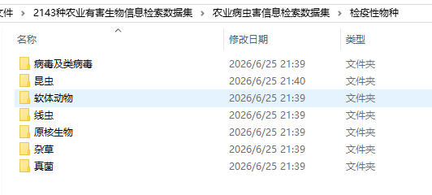
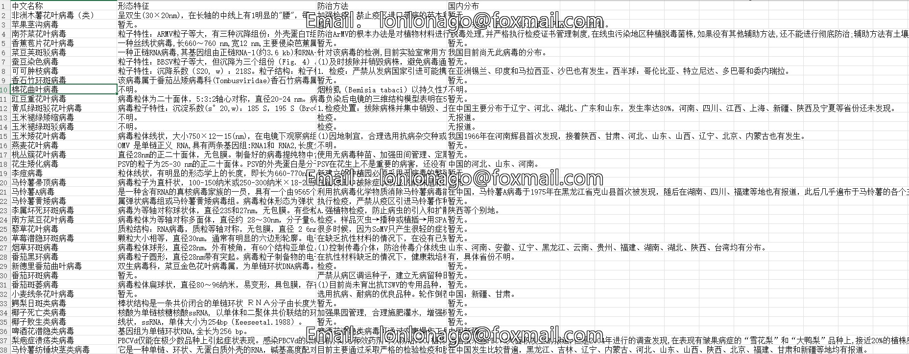

## Body

2143 Dataset of Agricultural Pests and Diseases Information Retrieval

The data spans from 2012 to 2024;

The dataset encompasses three categories: domestic agricultural pests, alien invasion species, and quarantine species.

Among the agricultural pests, there are 83 crop-related diseases and 1254 pests;

For alien invasion species, there are 70 alien invasion animals and 130 alien invasion plants;

Regarding quarantine species, there are 99 insects, 9 soft-bodied animals, 19 fungi, 25 prokaryotic organisms, 18 nematodes, 37 viruses and virophages, and 42 weeds.

Totally, there are 2143 types of pests and diseases.

Includes author's source article

## Images

item_1061843705146

Here is a pay link on Stripe ( https://buy.stripe.com/3cs8yP7sY87d0vu9AB ). Please contact me lonlonago@foxmail.com after funding $89, and I will send you a complete data files , thank you!

